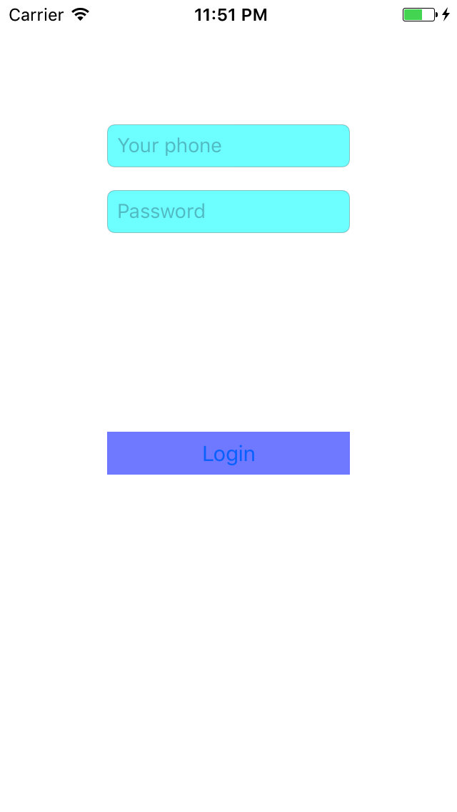

<h2>Table of Contents</h2>

<ul>
<li><a href="#orgheadline2">1. Swift 实现登录框抖动。</a>
<ul>
<li><a href="#orgheadline1">1.1. 模拟用户输入信息错误时， 输入框来回摆动，提示用户。</a></li>
</ul>
</li>
</ul>

# Swift 实现登录框抖动。

## 模拟用户输入信息错误时， 输入框来回摆动，提示用户。

    使用 protocol 方式实现

**Screenshots**

